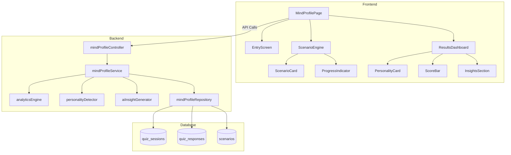

# Trader Mind Profile - Design Document

## Overview

The Trader Mind Profile is an isolated feature module that provides AI-powered behavioral trading analysis through interactive scenarios. The system evaluates traders' psychological profiles using a hybrid approach: deterministic rule-based scoring combined with LLM-generated personalized insights.

### Key Design Principles

1. **Isolation**: Feature operates independently without modifying existing components
2. **Hybrid Intelligence**: Rule-based analytics for consistency + AI for personalization
3. **Performance**: Complete quiz experience in under 3 minutes
4. **Minimal Integration**: Only touches routing and navigation

### User Flow

```
Entry Screen → Scenario 1-7 → Submit Responses → Rule-Based Analysis → AI Insight Generation → Results Dashboard
```

### Technology Stack

- Frontend: React with CSS Modules (matching existing pattern)
- Backend: Node.js/Express with service layer architecture
- Database: PostgreSQL with UUID primary keys
- AI: OpenAI API for insight generation
- State Management: React hooks (useState, useEffect)

## Architecture

### High-Level Component Architecture



### Integration Points

The feature integrates minimally with the existing system:

1. **Routing**: Add `/mind-profile` route to `client/src/App.jsx`
2. **Navigation**: Add menu item to `client/src/components/dashboard/Sidebar.jsx`
3. **Authentication**: Use existing `AuthenticatedLayout` and `requireAuth` middleware
4. **API Pattern**: Follow existing controller → service → repository pattern
5. **Styling**: Use CSS Modules matching existing component style

### Separation of Concerns

```
Rule-Based Layer (Deterministic)
├── Analytics Engine: Computes all behavioral scores
├── Personality Detector: Determines personality type
└── Source of truth for all quantitative metrics

AI Layer (Generative)
└── AI Insight Generator: Produces personalized narrative insights
```

## Components and Interfaces

### Frontend Components

#### 1. MindProfilePage (Main Container)

**Location**: `client/src/pages/MindProfilePage.jsx`

**Responsibilities**:
- Orchestrates the entire quiz flow
- Manages state transitions between screens
- Handles API communication
- Wraps content in AuthenticatedLayout

**State**:
```javascript
{
  currentScreen: 'entry' | 'quiz' | 'results',
  scenarios: Array<Scenario>,
  responses: Array<UserResponse>,
  currentScenarioIndex: number,
  results: QuizResults | null,
  loading: boolean,
  error: string | null
}
```

**Key Methods**:
- `startQuiz()`: Fetch scenarios and transition to quiz
- `handleResponse(response)`: Record user response and advance
- `submitQuiz()`: Send responses to backend
- `generateInsights()`: Request AI insights

#### 2. EntryScreen

**Location**: `client/src/components/mind-profile/EntryScreen.jsx`

**Props**:
```typescript
{
  onStart: () => void
}
```

**UI Elements**:
- Title: "Test Your Trading Mindset in 2 Minutes"
- Description paragraph
- Start button with icon
- Visual branding elements

#### 3. ScenarioEngine

**Location**: `client/src/components/mind-profile/ScenarioEngine.jsx`

**Props**:
```typescript
{
  scenario: Scenario,
  scenarioNumber: number,
  totalScenarios: number,
  onResponse: (response: UserResponse) => void
}
```

**Responsibilities**:
- Display scenario description
- Render 3 option buttons
- Track response timing
- Detect answer changes
- Auto-advance on selection

**State**:
```javascript
{
  selectedOption: number | null,
  startTime: number,
  hasChanged: boolean
}
```


#### 4. ResultsDashboard

**Location**: `client/src/components/mind-profile/ResultsDashboard.jsx`

**Props**:
```typescript
{
  results: QuizResults,
  onRetake?: () => void
}
```

**Responsibilities**:
- Display personality type card
- Render score bars with animations
- Show AI-generated insights
- Highlight market prediction
- Display improvement plan

**Sub-components**:
- PersonalityCard: Shows personality type with icon and description
- ScoreBar: Animated progress bar for each behavioral score
- InsightsSection: Formatted AI insights with markdown support
- PredictionCard: Highlighted market prediction
- ImprovementPlan: Bullet list with checkboxes

#### 5. ScenarioCard

**Location**: `client/src/components/mind-profile/ScenarioCard.jsx`

**Props**:
```typescript
{
  description: string,
  options: Array<string>,
  selectedOption: number | null,
  onSelect: (optionIndex: number) => void
}
```

**UI Behavior**:
- Options rendered as large clickable cards
- Visual feedback on hover
- Selected state styling
- Smooth transitions

#### 6. ProgressIndicator

**Location**: `client/src/components/mind-profile/ProgressIndicator.jsx`

**Props**:
```typescript
{
  current: number,
  total: number
}
```

**Display**: "Question 3 of 7" with progress bar

### Backend Components

#### 1. mindProfileController

**Location**: `server/controllers/mindProfileController.js`

**Endpoints**:

```javascript
// POST /api/mind-profile/submit-quiz
export const submitQuiz = async (req, res) => {
  // Validate request body
  // Call mindProfileService.processQuiz()
  // Return { success, data: { personality, scores, sessionId } }
}

// POST /api/mind-profile/generate-insights
export const generateInsights = async (req, res) => {
  // Validate sessionId
  // Call mindProfileService.generateInsights()
  // Return { success, data: { aiInsights, prediction, improvementPlan } }
}

// GET /api/mind-profile/scenarios
export const getScenarios = async (req, res) => {
  // Call mindProfileService.getScenarios()
  // Return randomized scenario set
}

// GET /api/mind-profile/history (optional)
export const getHistory = async (req, res) => {
  // Return user's previous quiz sessions
}
```

#### 2. mindProfileService

**Location**: `server/services/mindProfileService.js`

**Extends**: `AIInsightsService` (for common utilities)

**Methods**:

```javascript
class MindProfileService extends AIInsightsService {
  async getScenarios(count = 7) {
    // Retrieve scenarios from repository
    // Randomize order
    // Ensure type distribution (profit, loss, neutral)
    // Return scenario set
  }

  async processQuiz(userId, responses) {
    // Validate responses
    // Compute behavioral scores via analyticsEngine
    // Determine personality via personalityDetector
    // Store session and responses via repository
    // Return { personality, scores, sessionId }
  }

  async generateInsights(sessionId) {
    // Retrieve session data
    // Call aiInsightGenerator.generate()
    // Update session with insights
    // Return { aiInsights, prediction, improvementPlan }
  }

  async getHistory(userId, limit = 10) {
    // Retrieve user's quiz history
    // Return sessions with scores and personality
  }
}
```


#### 3. analyticsEngine

**Location**: `server/services/analyticsEngine.js`

**Purpose**: Pure rule-based score calculation (no AI)

**Methods**:

```javascript
class AnalyticsEngine {
  computeScores(responses) {
    const riskScore = this.calculateRiskScore(responses);
    const fearScore = this.calculateFearScore(responses);
    const revengeScore = this.calculateRevengeScore(responses);
    const disciplineScore = this.calculateDisciplineScore(responses);
    const hesitationScore = this.calculateHesitationScore(responses);
    const confidenceScore = this.calculateConfidenceScore(responses);
    
    return {
      risk_score: riskScore,
      fear_score: fearScore,
      revenge_score: revengeScore,
      discipline_score: disciplineScore,
      hesitation_score: hesitationScore,
      confidence_score: confidenceScore
    };
  }

  calculateRiskScore(responses) {
    // Percentage of aggressive choices
    const aggressiveChoices = responses.filter(r => r.choice_type === 'aggressive').length;
    return Math.round((aggressiveChoices / responses.length) * 100);
  }

  calculateFearScore(responses) {
    // Percentage of conservative choices in profit scenarios
    const profitScenarios = responses.filter(r => r.scenario_type === 'profit');
    const conservativeInProfit = profitScenarios.filter(r => r.choice_type === 'conservative').length;
    return profitScenarios.length > 0 
      ? Math.round((conservativeInProfit / profitScenarios.length) * 100) 
      : 0;
  }

  calculateRevengeScore(responses) {
    // Percentage of aggressive choices in loss scenarios
    const lossScenarios = responses.filter(r => r.scenario_type === 'loss');
    const aggressiveInLoss = lossScenarios.filter(r => r.choice_type === 'aggressive').length;
    return lossScenarios.length > 0 
      ? Math.round((aggressiveInLoss / lossScenarios.length) * 100) 
      : 0;
  }

  calculateDisciplineScore(responses) {
    // Percentage of correct answers (risk-management aligned)
    const correctAnswers = responses.filter(r => r.is_correct).length;
    return Math.round((correctAnswers / responses.length) * 100);
  }

  calculateHesitationScore(responses) {
    // Based on slow responses (>8s) and changed answers
    const slowResponses = responses.filter(r => r.response_time > 8).length;
    const changedAnswers = responses.filter(r => r.changed_answer).length;
    const hesitationIndicators = slowResponses + changedAnswers;
    return Math.min(100, Math.round((hesitationIndicators / responses.length) * 100));
  }

  calculateConfidenceScore(responses) {
    // Based on fast responses (<3s) and consistent answers
    const fastResponses = responses.filter(r => r.response_time < 3).length;
    const consistentAnswers = responses.filter(r => !r.changed_answer).length;
    const confidenceIndicators = fastResponses + (consistentAnswers * 0.5);
    return Math.min(100, Math.round((confidenceIndicators / responses.length) * 50));
  }
}
```

#### 4. personalityDetector

**Location**: `server/services/personalityDetector.js`

**Purpose**: Rule-based personality classification

**Methods**:

```javascript
class PersonalityDetector {
  detectPersonality(scores) {
    const personalities = [
      {
        type: 'Fearful Protector',
        condition: scores.fear_score > 60 && scores.risk_score < 40,
        priority: scores.fear_score
      },
      {
        type: 'Revenge Trader',
        condition: scores.revenge_score > 60,
        priority: scores.revenge_score
      },
      {
        type: 'Overconfident Gambler',
        condition: scores.risk_score > 70 && scores.discipline_score < 40,
        priority: scores.risk_score
      },
      {
        type: 'Hesitant Analyst',
        condition: scores.hesitation_score > 60,
        priority: scores.hesitation_score
      },
      {
        type: 'Disciplined Sniper',
        condition: scores.discipline_score > 70 && scores.confidence_score > 60,
        priority: scores.discipline_score + scores.confidence_score
      }
    ];

    const matches = personalities.filter(p => p.condition);
    
    if (matches.length === 0) {
      return 'Balanced Trader'; // Default
    }

    // Return personality with highest priority
    return matches.reduce((prev, current) => 
      current.priority > prev.priority ? current : prev
    ).type;
  }

  getPersonalityDescription(personalityType) {
    const descriptions = {
      'Fearful Protector': 'You prioritize capital preservation over growth opportunities.',
      'Revenge Trader': 'You tend to chase losses with aggressive recovery attempts.',
      'Overconfident Gambler': 'You take excessive risks without proper risk management.',
      'Hesitant Analyst': 'You overthink decisions and struggle with execution.',
      'Disciplined Sniper': 'You execute with precision and maintain emotional control.',
      'Balanced Trader': 'You demonstrate balanced decision-making across scenarios.'
    };
    return descriptions[personalityType] || '';
  }
}
```


#### 5. aiInsightGenerator

**Location**: `server/services/aiInsightGenerator.js`

**Purpose**: LLM-powered personalized insight generation

**Methods**:

```javascript
class AIInsightGenerator {
  constructor() {
    this.timeout = 10000; // 10 second timeout
  }

  async generate(personality, scores, responseSummary) {
    try {
      const prompt = this.buildPrompt(personality, scores, responseSummary);
      const response = await this.callLLM(prompt);
      return this.parseResponse(response);
    } catch (error) {
      console.error('AI insight generation failed:', error);
      return this.getFallbackInsights(personality, scores);
    }
  }

  buildPrompt(personality, scores, responseSummary) {
    return `You are a trading psychology expert analyzing a trader's behavioral profile.

Personality Type: ${personality}

Behavioral Scores (0-100):
- Risk Score: ${scores.risk_score}
- Fear Score: ${scores.fear_score}
- Revenge Score: ${scores.revenge_score}
- Discipline Score: ${scores.discipline_score}
- Hesitation Score: ${scores.hesitation_score}
- Confidence Score: ${scores.confidence_score}

Response Summary:
${responseSummary}

Provide a concise, sharp analysis in the following format:

INSIGHTS:
[2-3 sentences explaining their trading psychology and decision patterns]

STRENGTHS:
[1-2 key strengths based on their profile]

WEAKNESSES:
[1-2 key weaknesses to address]

MARKET_PREDICTION:
[One specific prediction about how they'll behave in the next market downturn or rally]

IMPROVEMENT_PLAN:
- [Actionable step 1]
- [Actionable step 2]
- [Actionable step 3]

Keep it direct, insightful, and actionable. No fluff.`;
  }

  async callLLM(prompt) {
    const controller = new AbortController();
    const timeoutId = setTimeout(() => controller.abort(), this.timeout);

    try {
      const response = await fetch('https://api.openai.com/v1/chat/completions', {
        method: 'POST',
        headers: {
          'Content-Type': 'application/json',
          'Authorization': `Bearer ${process.env.OPENAI_API_KEY}`
        },
        body: JSON.stringify({
          model: 'gpt-4',
          messages: [{ role: 'user', content: prompt }],
          temperature: 0.7,
          max_tokens: 500
        }),
        signal: controller.signal
      });

      clearTimeout(timeoutId);
      const data = await response.json();
      return data.choices[0].message.content;
    } catch (error) {
      clearTimeout(timeoutId);
      throw error;
    }
  }

  parseResponse(llmOutput) {
    // Parse structured output from LLM
    const sections = {
      aiInsights: this.extractSection(llmOutput, 'INSIGHTS'),
      strengths: this.extractSection(llmOutput, 'STRENGTHS'),
      weaknesses: this.extractSection(llmOutput, 'WEAKNESSES'),
      prediction: this.extractSection(llmOutput, 'MARKET_PREDICTION'),
      improvementPlan: this.extractBulletList(llmOutput, 'IMPROVEMENT_PLAN')
    };
    return sections;
  }

  extractSection(text, sectionName) {
    const regex = new RegExp(`${sectionName}:\\s*([^\\n]+(?:\\n(?!\\w+:)[^\\n]+)*)`, 'i');
    const match = text.match(regex);
    return match ? match[1].trim() : '';
  }

  extractBulletList(text, sectionName) {
    const regex = new RegExp(`${sectionName}:\\s*([\\s\\S]*?)(?=\\n\\w+:|$)`, 'i');
    const match = text.match(regex);
    if (!match) return [];
    
    return match[1]
      .split('\n')
      .filter(line => line.trim().startsWith('-'))
      .map(line => line.trim().substring(1).trim());
  }

  getFallbackInsights(personality, scores) {
    // Generic insights when LLM fails
    return {
      aiInsights: `As a ${personality}, you demonstrate specific behavioral patterns in trading scenarios. Your scores suggest areas for both strength and improvement.`,
      strengths: 'Consistent decision-making approach',
      weaknesses: 'Potential for emotional bias in high-pressure situations',
      prediction: 'In volatile markets, you may need to consciously manage your natural tendencies.',
      improvementPlan: [
        'Practice scenario-based decision making',
        'Keep a trading journal to track emotional patterns',
        'Set predefined rules for high-stress situations'
      ]
    };
  }
}
```

#### 6. mindProfileRepository

**Location**: `server/repositories/mindProfileRepository.js`

**Purpose**: Database operations for quiz data

**Methods**:

```javascript
class MindProfileRepository {
  async getScenarios(limit = 10) {
    // SELECT * FROM scenarios ORDER BY RANDOM() LIMIT limit
  }

  async createSession(userId, personality, scores) {
    // INSERT INTO quiz_sessions
    // RETURN session_id
  }

  async saveResponses(sessionId, responses) {
    // INSERT INTO quiz_responses (batch)
  }

  async updateSessionWithInsights(sessionId, insights) {
    // UPDATE quiz_sessions SET ai_insights, prediction, improvement_plan
  }

  async getSession(sessionId) {
    // SELECT * FROM quiz_sessions WHERE id = sessionId
  }

  async getUserHistory(userId, limit = 10) {
    // SELECT * FROM quiz_sessions WHERE user_id = userId ORDER BY created_at DESC
  }
}
```


## Data Models

### Database Schema

#### Table: scenarios

Stores predefined trading scenarios for the quiz.

```sql
CREATE TABLE scenarios (
  id UUID PRIMARY KEY DEFAULT gen_random_uuid(),
  description TEXT NOT NULL,
  option_1 TEXT NOT NULL,
  option_2 TEXT NOT NULL,
  option_3 TEXT NOT NULL,
  correct_option INTEGER NOT NULL CHECK (correct_option BETWEEN 1 AND 3),
  option_1_type VARCHAR(20) NOT NULL CHECK (option_1_type IN ('aggressive', 'conservative', 'balanced')),
  option_2_type VARCHAR(20) NOT NULL CHECK (option_2_type IN ('aggressive', 'conservative', 'balanced')),
  option_3_type VARCHAR(20) NOT NULL CHECK (option_3_type IN ('aggressive', 'conservative', 'balanced')),
  scenario_type VARCHAR(20) NOT NULL CHECK (scenario_type IN ('profit', 'loss', 'neutral')),
  created_at TIMESTAMP DEFAULT CURRENT_TIMESTAMP,
  updated_at TIMESTAMP DEFAULT CURRENT_TIMESTAMP
);

CREATE INDEX idx_scenarios_type ON scenarios(scenario_type);
```

**Sample Data**:
```sql
INSERT INTO scenarios (description, option_1, option_2, option_3, correct_option, option_1_type, option_2_type, option_3_type, scenario_type) VALUES
('Your position is up 25% in 2 days. What do you do?',
 'Take full profit immediately',
 'Hold for more gains',
 'Take 50% profit, let rest run with stop-loss',
 3, 'conservative', 'aggressive', 'balanced', 'profit'),
 
('You just lost 15% on a trade. Your next move?',
 'Double position size to recover faster',
 'Take a break and analyze what went wrong',
 'Immediately enter opposite position',
 2, 'aggressive', 'balanced', 'aggressive', 'loss'),
 
('Market drops 5% while you''re in profit. You:',
 'Exit immediately to protect gains',
 'Hold based on original plan',
 'Add to position at lower price',
 2, 'conservative', 'balanced', 'aggressive', 'neutral');
```

#### Table: quiz_sessions

Stores completed quiz sessions with results.

```sql
CREATE TABLE quiz_sessions (
  id UUID PRIMARY KEY DEFAULT gen_random_uuid(),
  user_id UUID NOT NULL REFERENCES users(id) ON DELETE CASCADE,
  personality_type VARCHAR(50) NOT NULL,
  risk_score INTEGER NOT NULL CHECK (risk_score BETWEEN 0 AND 100),
  fear_score INTEGER NOT NULL CHECK (fear_score BETWEEN 0 AND 100),
  revenge_score INTEGER NOT NULL CHECK (revenge_score BETWEEN 0 AND 100),
  discipline_score INTEGER NOT NULL CHECK (discipline_score BETWEEN 0 AND 100),
  hesitation_score INTEGER NOT NULL CHECK (hesitation_score BETWEEN 0 AND 100),
  confidence_score INTEGER NOT NULL CHECK (confidence_score BETWEEN 0 AND 100),
  ai_insights TEXT,
  ai_strengths TEXT,
  ai_weaknesses TEXT,
  market_prediction TEXT,
  improvement_plan JSONB,
  completed_at TIMESTAMP DEFAULT CURRENT_TIMESTAMP,
  created_at TIMESTAMP DEFAULT CURRENT_TIMESTAMP
);

CREATE INDEX idx_quiz_sessions_user_id ON quiz_sessions(user_id);
CREATE INDEX idx_quiz_sessions_completed_at ON quiz_sessions(completed_at DESC);
CREATE INDEX idx_quiz_sessions_user_completed ON quiz_sessions(user_id, completed_at DESC);
```

#### Table: quiz_responses

Stores individual responses for each scenario in a session.

```sql
CREATE TABLE quiz_responses (
  id UUID PRIMARY KEY DEFAULT gen_random_uuid(),
  session_id UUID NOT NULL REFERENCES quiz_sessions(id) ON DELETE CASCADE,
  scenario_id UUID NOT NULL REFERENCES scenarios(id),
  selected_option INTEGER NOT NULL CHECK (selected_option BETWEEN 1 AND 3),
  is_correct BOOLEAN NOT NULL,
  choice_type VARCHAR(20) NOT NULL CHECK (choice_type IN ('aggressive', 'conservative', 'balanced')),
  scenario_type VARCHAR(20) NOT NULL CHECK (scenario_type IN ('profit', 'loss', 'neutral')),
  response_time DECIMAL(5, 2) NOT NULL CHECK (response_time > 0),
  changed_answer BOOLEAN NOT NULL DEFAULT FALSE,
  created_at TIMESTAMP DEFAULT CURRENT_TIMESTAMP
);

CREATE INDEX idx_quiz_responses_session_id ON quiz_responses(session_id);
CREATE INDEX idx_quiz_responses_scenario_id ON quiz_responses(scenario_id);
```

### API Data Models

#### Request: POST /api/mind-profile/submit-quiz

```typescript
{
  responses: Array<{
    scenarioId: string,
    selectedOption: number,      // 1, 2, or 3
    responseTime: number,         // seconds
    changedAnswer: boolean
  }>
}
```

#### Response: POST /api/mind-profile/submit-quiz

```typescript
{
  success: boolean,
  data: {
    sessionId: string,
    personality: string,
    scores: {
      risk_score: number,
      fear_score: number,
      revenge_score: number,
      discipline_score: number,
      hesitation_score: number,
      confidence_score: number
    }
  }
}
```

#### Request: POST /api/mind-profile/generate-insights

```typescript
{
  sessionId: string
}
```

#### Response: POST /api/mind-profile/generate-insights

```typescript
{
  success: boolean,
  data: {
    aiInsights: string,
    strengths: string,
    weaknesses: string,
    prediction: string,
    improvementPlan: string[]
  }
}
```

#### Response: GET /api/mind-profile/scenarios

```typescript
{
  success: boolean,
  data: {
    scenarios: Array<{
      id: string,
      description: string,
      options: [string, string, string]
    }>
  }
}
```


## Correctness Properties

*A property is a characteristic or behavior that should hold true across all valid executions of a system-essentially, a formal statement about what the system should do. Properties serve as the bridge between human-readable specifications and machine-verifiable correctness guarantees.*

### Property Reflection

After analyzing all acceptance criteria, I identified the following redundancies:

- Requirements 8.3, 8.4, 9.3, 10.4, 14.5, 15.1, 15.2, 20.4 are covered by other properties
- Requirements 4.8, 11.2, 12.5, 20.3 are architectural constraints rather than testable behaviors
- Requirements 6.8, 7.4, 7.7 involve subjective qualities (tone, visual styling, responsive design) that cannot be programmatically verified
- Score calculation properties (4.1-4.6) can be combined into a single comprehensive property about score computation correctness
- Personality classification properties (5.1-5.5) can be combined into a single property about rule-based classification
- Data persistence properties (10.1, 10.2, 10.3, 10.5, 10.6, 10.7) can be combined into a comprehensive round-trip property

### Property 1: Scenario Count Constraint

*For any* quiz session, the number of scenarios presented shall be between 5 and 7 inclusive.

**Validates: Requirements 2.1**

### Property 2: Scenario Structure Completeness

*For any* scenario displayed, it shall contain a description and exactly 3 selectable options.

**Validates: Requirements 2.2, 2.3**

### Property 3: Single Selection Enforcement

*For any* scenario, the user interface shall allow selection of only one option at a time, preventing multiple simultaneous selections.

**Validates: Requirements 2.4**

### Property 4: Scenario Advancement Performance

*For any* scenario, when a user selects an option, the system shall advance to the next scenario within 500 milliseconds.

**Validates: Requirements 2.5, 14.1**

### Property 5: Progress Indicator Accuracy

*For any* scenario being displayed, the progress indicator shall show the correct current scenario number and total scenario count.

**Validates: Requirements 2.6**

### Property 6: Response Data Capture Completeness

*For any* user selection, the system shall record the selected option identifier, correctness flag, response time, change status, and scenario type.

**Validates: Requirements 3.1, 3.2, 3.3, 3.4, 3.5**

### Property 7: Response Data Persistence

*For any* completed quiz session, all user response data shall be stored and retrievable from the database.

**Validates: Requirements 3.6, 8.5**

### Property 8: Score Calculation Correctness

*For any* set of quiz responses, the Analytics Engine shall compute all six behavioral scores (risk, fear, revenge, discipline, hesitation, confidence) as integers between 0 and 100 using the defined formulas without invoking any AI services.

**Validates: Requirements 4.1, 4.2, 4.3, 4.4, 4.5, 4.6, 4.7, 20.1**

### Property 9: Personality Classification Rules

*For any* set of behavioral scores, the Personality Detector shall classify the personality type using only rule-based logic according to the defined conditions (Fearful Protector, Revenge Trader, Overconfident Gambler, Hesitant Analyst, Disciplined Sniper), selecting the highest priority match or defaulting to Balanced Trader.

**Validates: Requirements 5.1, 5.2, 5.3, 5.4, 5.5, 5.6, 20.2**

### Property 10: AI Insight Generation Contract

*For any* completed quiz session with computed scores, the AI Insight Generator shall invoke the LLM API with personality type, all behavioral scores, and response summary, requesting insights, strengths, weaknesses, prediction, and improvement plan.

**Validates: Requirements 6.1, 6.2**

### Property 11: Results Dashboard Data Display

*For any* quiz result, the Results Dashboard shall display the personality type, score bars for risk/discipline/confidence, AI insights text, and improvement plan as a list.

**Validates: Requirements 7.1, 7.2, 7.3, 7.5, 7.6**

### Property 12: Quiz Submission Response Structure

*For any* valid quiz submission, the API shall return a JSON response containing success flag, personality string, scores object with all six scores, and a session identifier.

**Validates: Requirements 8.6, 15.3, 15.5**

### Property 13: Input Validation Enforcement

*For any* quiz submission, the system shall validate that the number of responses matches scenarios presented, all required fields are present (selected_option, response_time, changed_answer, scenario_type), response_time is positive, and changed_answer is boolean.

**Validates: Requirements 8.2, 13.1, 13.2, 13.3, 13.4**

### Property 14: Session Data Round-Trip

*For any* quiz session, after storing the session with user ID, personality, scores, and insights, retrieving the session by ID shall return equivalent data.

**Validates: Requirements 8.5, 9.2, 10.1, 10.2, 10.3, 10.5, 10.6, 10.7**

### Property 15: Insight Generation Response Structure

*For any* valid insight generation request, the API shall return a JSON response containing success flag, ai_insights string, prediction string, and improvement_plan array of strings.

**Validates: Requirements 9.4, 15.4, 15.5**

### Property 16: Authentication Enforcement

*For any* request to the /mind-profile route, the system shall require authentication and redirect unauthenticated users to the sign-in page.

**Validates: Requirements 11.4**

### Property 17: Scenario Type Distribution

*For any* quiz session, the selected scenarios shall include at least one scenario of each type (profit, loss, neutral).

**Validates: Requirements 12.4**

### Property 18: Scenario Randomization

*For any* two quiz sessions, the order of scenarios shall differ, demonstrating randomization.

**Validates: Requirements 12.3**

### Property 19: Scenario Data Structure

*For any* stored scenario, it shall contain description, three options, correct option index, option types, and scenario type.

**Validates: Requirements 12.1, 12.2**

### Property 20: Validation Error Messages

*For any* validation failure, the system shall return an error response with a descriptive message indicating which validation rule failed.

**Validates: Requirements 13.5, 15.6**

### Property 21: Score Computation Performance

*For any* set of quiz responses, the Analytics Engine shall compute all behavioral scores within 500 milliseconds.

**Validates: Requirements 14.2**

### Property 22: Quiz Submission Performance

*For any* completed quiz, the system shall submit responses to the backend and receive rule-based results within 3 seconds total (1 second submission + 2 seconds processing).

**Validates: Requirements 14.3, 14.4**

### Property 23: API Error Response Structure

*For any* API error condition, the system shall return a response with success: false and an error field containing a descriptive message.

**Validates: Requirements 8.7, 15.6**


## Error Handling

### Frontend Error Handling

#### Network Errors
- Display user-friendly error messages when API calls fail
- Provide retry mechanism for transient failures
- Gracefully degrade when AI insights fail (show rule-based results only)

#### Validation Errors
- Prevent quiz submission if responses are incomplete
- Show inline validation errors for malformed data
- Disable submit button until all scenarios are answered

#### State Management Errors
- Implement error boundaries to catch React errors
- Provide fallback UI when components fail to render
- Log errors to console for debugging

### Backend Error Handling

#### Input Validation
- Return 400 Bad Request with descriptive error messages
- Validate all required fields before processing
- Check data types and value ranges

#### Database Errors
- Catch and log database connection failures
- Return 500 Internal Server Error for database issues
- Implement transaction rollback for failed operations

#### AI Service Errors
- Implement 10-second timeout for LLM API calls
- Provide fallback generic insights when AI fails
- Log AI service failures for monitoring
- Return 200 OK with fallback data (not 500 error)

#### Authentication Errors
- Return 401 Unauthorized for missing/invalid tokens
- Return 404 Not Found for invalid session IDs
- Redirect to sign-in page on frontend for auth failures

### Error Response Format

All error responses follow this structure:

```json
{
  "success": false,
  "error": {
    "code": "ERROR_CODE",
    "message": "Human-readable error description",
    "field": "fieldName" // Optional, for validation errors
  }
}
```

### Error Codes

- `MISSING_PARAMETER`: Required field missing from request
- `INVALID_VALUE`: Field value outside acceptable range
- `INVALID_TYPE`: Field has wrong data type
- `VALIDATION_FAILED`: General validation failure
- `SESSION_NOT_FOUND`: Invalid session ID
- `UNAUTHORIZED`: Authentication required
- `AI_SERVICE_TIMEOUT`: LLM API timeout
- `AI_SERVICE_ERROR`: LLM API error
- `DATABASE_ERROR`: Database operation failed
- `INTERNAL_ERROR`: Unexpected server error

## Testing Strategy

### Dual Testing Approach

The feature requires both unit tests and property-based tests for comprehensive coverage:

- **Unit tests**: Verify specific examples, edge cases, and error conditions
- **Property tests**: Verify universal properties across all inputs

### Unit Testing

#### Frontend Unit Tests (Jest + React Testing Library)

Focus areas:
- Component rendering with specific props
- User interaction handlers (button clicks, option selection)
- State transitions between screens
- Error boundary behavior
- API call mocking and error handling

Example tests:
- EntryScreen displays correct title and description
- ScenarioCard renders three options
- Clicking start button triggers navigation
- Invalid session ID shows error message
- Timeout error displays fallback insights

#### Backend Unit Tests (Jest)

Focus areas:
- API endpoint existence and routing
- Request validation with invalid inputs
- Error response formatting
- Fallback insight generation
- Database connection mocking

Example tests:
- POST /api/mind-profile/submit-quiz returns 400 for missing fields
- Invalid session ID returns 404
- LLM timeout triggers fallback insights
- Error responses include descriptive messages
- Authentication middleware blocks unauthenticated requests

### Property-Based Testing

#### Configuration
- Library: fast-check (JavaScript property-based testing)
- Minimum iterations: 100 per property test
- Each test references its design document property

#### Property Test Tags
Format: `// Feature: trader-mind-profile, Property {number}: {property_text}`

#### Frontend Property Tests

**Property 1: Scenario Count Constraint**
```javascript
// Feature: trader-mind-profile, Property 1: Scenario count between 5-7
fc.assert(
  fc.property(
    fc.array(scenarioGenerator(), { minLength: 5, maxLength: 7 }),
    (scenarios) => {
      const count = scenarios.length;
      return count >= 5 && count <= 7;
    }
  ),
  { numRuns: 100 }
);
```

**Property 2: Scenario Structure Completeness**
```javascript
// Feature: trader-mind-profile, Property 2: Scenario has description and 3 options
fc.assert(
  fc.property(
    scenarioGenerator(),
    (scenario) => {
      return (
        scenario.description.length > 0 &&
        scenario.options.length === 3 &&
        scenario.options.every(opt => opt.length > 0)
      );
    }
  ),
  { numRuns: 100 }
);
```

**Property 6: Response Data Capture Completeness**
```javascript
// Feature: trader-mind-profile, Property 6: All response fields captured
fc.assert(
  fc.property(
    responseGenerator(),
    (response) => {
      return (
        response.hasOwnProperty('selectedOption') &&
        response.hasOwnProperty('isCorrect') &&
        response.hasOwnProperty('responseTime') &&
        response.hasOwnProperty('changedAnswer') &&
        response.hasOwnProperty('scenarioType')
      );
    }
  ),
  { numRuns: 100 }
);
```

#### Backend Property Tests

**Property 8: Score Calculation Correctness**
```javascript
// Feature: trader-mind-profile, Property 8: Scores are 0-100 integers
fc.assert(
  fc.property(
    fc.array(responseDataGenerator(), { minLength: 5, maxLength: 7 }),
    (responses) => {
      const scores = analyticsEngine.computeScores(responses);
      return Object.values(scores).every(score => 
        Number.isInteger(score) && score >= 0 && score <= 100
      );
    }
  ),
  { numRuns: 100 }
);
```

**Property 9: Personality Classification Rules**
```javascript
// Feature: trader-mind-profile, Property 9: Personality classification is deterministic
fc.assert(
  fc.property(
    scoresGenerator(),
    (scores) => {
      const personality1 = personalityDetector.detectPersonality(scores);
      const personality2 = personalityDetector.detectPersonality(scores);
      return personality1 === personality2; // Deterministic
    }
  ),
  { numRuns: 100 }
);
```

**Property 13: Input Validation Enforcement**
```javascript
// Feature: trader-mind-profile, Property 13: Invalid submissions rejected
fc.assert(
  fc.property(
    invalidSubmissionGenerator(),
    async (submission) => {
      const response = await submitQuiz(submission);
      return response.success === false && response.error !== undefined;
    }
  ),
  { numRuns: 100 }
);
```

**Property 14: Session Data Round-Trip**
```javascript
// Feature: trader-mind-profile, Property 14: Session data persists correctly
fc.assert(
  fc.property(
    sessionDataGenerator(),
    async (sessionData) => {
      const sessionId = await repository.createSession(sessionData);
      const retrieved = await repository.getSession(sessionId);
      return (
        retrieved.personality === sessionData.personality &&
        retrieved.scores.risk_score === sessionData.scores.risk_score &&
        retrieved.userId === sessionData.userId
      );
    }
  ),
  { numRuns: 100 }
);
```

**Property 17: Scenario Type Distribution**
```javascript
// Feature: trader-mind-profile, Property 17: All scenario types represented
fc.assert(
  fc.property(
    fc.integer({ min: 5, max: 7 }),
    async (count) => {
      const scenarios = await mindProfileService.getScenarios(count);
      const types = scenarios.map(s => s.scenario_type);
      return (
        types.includes('profit') &&
        types.includes('loss') &&
        types.includes('neutral')
      );
    }
  ),
  { numRuns: 100 }
);
```

**Property 21: Score Computation Performance**
```javascript
// Feature: trader-mind-profile, Property 21: Scores computed within 500ms
fc.assert(
  fc.property(
    fc.array(responseDataGenerator(), { minLength: 5, maxLength: 7 }),
    (responses) => {
      const startTime = Date.now();
      analyticsEngine.computeScores(responses);
      const duration = Date.now() - startTime;
      return duration < 500;
    }
  ),
  { numRuns: 100 }
);
```

### Integration Testing

Test complete user flows:
1. Start quiz → Answer scenarios → Submit → View results
2. Authentication check → Redirect flow
3. AI service failure → Fallback insights
4. Database persistence → Data retrieval

### Edge Case Testing

Specific edge cases to test:
- Empty scenario list
- All responses identical
- Extreme response times (0.1s, 60s)
- All answers changed
- No personality conditions match (default case)
- LLM API timeout
- LLM API error response
- Invalid session ID
- Unauthenticated access
- Malformed API requests

### Test Data Generators

Implement generators for property-based testing:

```javascript
const scenarioGenerator = () => fc.record({
  id: fc.uuid(),
  description: fc.string({ minLength: 20, maxLength: 200 }),
  options: fc.tuple(
    fc.string({ minLength: 10, maxLength: 100 }),
    fc.string({ minLength: 10, maxLength: 100 }),
    fc.string({ minLength: 10, maxLength: 100 })
  ),
  correctOption: fc.integer({ min: 1, max: 3 }),
  scenarioType: fc.constantFrom('profit', 'loss', 'neutral')
});

const responseDataGenerator = () => fc.record({
  scenarioId: fc.uuid(),
  selectedOption: fc.integer({ min: 1, max: 3 }),
  isCorrect: fc.boolean(),
  choiceType: fc.constantFrom('aggressive', 'conservative', 'balanced'),
  scenarioType: fc.constantFrom('profit', 'loss', 'neutral'),
  responseTime: fc.float({ min: 0.5, max: 30 }),
  changedAnswer: fc.boolean()
});

const scoresGenerator = () => fc.record({
  risk_score: fc.integer({ min: 0, max: 100 }),
  fear_score: fc.integer({ min: 0, max: 100 }),
  revenge_score: fc.integer({ min: 0, max: 100 }),
  discipline_score: fc.integer({ min: 0, max: 100 }),
  hesitation_score: fc.integer({ min: 0, max: 100 }),
  confidence_score: fc.integer({ min: 0, max: 100 })
});
```

### Test Coverage Goals

- Unit test coverage: >80% for all components and services
- Property test coverage: All 23 correctness properties
- Integration test coverage: All critical user flows
- Edge case coverage: All identified edge cases

### Continuous Testing

- Run unit tests on every commit
- Run property tests on pull requests
- Run integration tests before deployment
- Monitor test execution time (target: <5 minutes total)


## File Structure

### New Files to Create

```
client/src/
├── pages/
│   └── MindProfilePage.jsx                    # Main page container
│
├── components/
│   └── mind-profile/
│       ├── EntryScreen.jsx                    # Welcome screen
│       ├── EntryScreen.module.css
│       ├── ScenarioEngine.jsx                 # Quiz flow controller
│       ├── ScenarioEngine.module.css
│       ├── ScenarioCard.jsx                   # Individual scenario display
│       ├── ScenarioCard.module.css
│       ├── ProgressIndicator.jsx              # Progress bar
│       ├── ProgressIndicator.module.css
│       ├── ResultsDashboard.jsx               # Results display
│       ├── ResultsDashboard.module.css
│       ├── PersonalityCard.jsx                # Personality type card
│       ├── PersonalityCard.module.css
│       ├── ScoreBar.jsx                       # Animated score bar
│       ├── ScoreBar.module.css
│       ├── InsightsSection.jsx                # AI insights display
│       ├── InsightsSection.module.css
│       ├── PredictionCard.jsx                 # Market prediction highlight
│       ├── PredictionCard.module.css
│       ├── ImprovementPlan.jsx                # Improvement plan list
│       └── ImprovementPlan.module.css
│
├── services/
│   └── mindProfileAPI.js                      # API client for mind profile
│
└── hooks/
    └── useMindProfile.js                      # Custom hook for quiz state

server/
├── controllers/
│   └── mindProfileController.js               # HTTP request handlers
│
├── services/
│   ├── mindProfileService.js                  # Business logic orchestration
│   ├── analyticsEngine.js                     # Rule-based score calculation
│   ├── personalityDetector.js                 # Rule-based personality detection
│   └── aiInsightGenerator.js                  # LLM-powered insight generation
│
├── repositories/
│   └── mindProfileRepository.js               # Database operations
│
├── routes/
│   └── mindProfileRoutes.js                   # Route definitions
│
└── database/
    ├── migrations/
    │   ├── 034_create_scenarios_table.sql
    │   ├── 035_create_quiz_sessions_table.sql
    │   └── 036_create_quiz_responses_table.sql
    │
    └── runMindProfileMigrations.js            # Migration runner

__tests__/
├── client/
│   └── mind-profile/
│       ├── EntryScreen.test.jsx
│       ├── ScenarioEngine.test.jsx
│       ├── ResultsDashboard.test.jsx
│       └── mindProfileAPI.test.js
│
└── server/
    └── mind-profile/
        ├── mindProfileController.test.js
        ├── analyticsEngine.test.js
        ├── analyticsEngine.property.test.js   # Property-based tests
        ├── personalityDetector.test.js
        ├── personalityDetector.property.test.js
        ├── aiInsightGenerator.test.js
        └── mindProfileService.test.js
```

### Files to Modify

```
client/src/
├── App.jsx                                    # Add /mind-profile route
└── components/
    └── dashboard/
        └── Sidebar.jsx                        # Add Mind Profile menu item

server/
└── server.js                                  # Register mindProfileRoutes
```

### Integration Points Summary

#### 1. Routing Integration (client/src/App.jsx)

Add route after existing authenticated routes:

```javascript
<Route 
  path="/mind-profile" 
  element={
    <AuthenticatedLayout>
      <motion.div
        initial="initial"
        animate="animate"
        exit="exit"
        variants={dashboardPageVariants}
        transition={fastTransition}
      >
        <MindProfilePage />
      </motion.div>
    </AuthenticatedLayout>
  } 
/>
```

#### 2. Navigation Integration (client/src/components/dashboard/Sidebar.jsx)

Add menu item to `menuItems` array:

```javascript
{ 
  icon: MdPsychology, 
  label: 'Mind Profile', 
  path: '/mind-profile', 
  description: 'Trading psychology' 
}
```

#### 3. Backend Route Registration (server/server.js)

Add after existing route registrations:

```javascript
import mindProfileRoutes from './routes/mindProfileRoutes.js'
app.use('/api/mind-profile', mindProfileRoutes)
```

#### 4. Database Migration Registration (server/database/init.js)

Add migration runner to the migration sequence.

## API Endpoint Specifications

### GET /api/mind-profile/scenarios

**Description**: Retrieve randomized scenarios for a quiz session

**Authentication**: Required

**Query Parameters**: None

**Response**:
```json
{
  "success": true,
  "data": {
    "scenarios": [
      {
        "id": "uuid",
        "description": "Your position is up 25% in 2 days. What do you do?",
        "options": [
          "Take full profit immediately",
          "Hold for more gains",
          "Take 50% profit, let rest run with stop-loss"
        ]
      }
    ]
  }
}
```

**Status Codes**:
- 200: Success
- 401: Unauthorized
- 500: Internal server error

### POST /api/mind-profile/submit-quiz

**Description**: Submit quiz responses and receive behavioral analysis

**Authentication**: Required

**Request Body**:
```json
{
  "responses": [
    {
      "scenarioId": "uuid",
      "selectedOption": 2,
      "responseTime": 4.5,
      "changedAnswer": false
    }
  ]
}
```

**Response**:
```json
{
  "success": true,
  "data": {
    "sessionId": "uuid",
    "personality": "Disciplined Sniper",
    "scores": {
      "risk_score": 45,
      "fear_score": 30,
      "revenge_score": 20,
      "discipline_score": 75,
      "hesitation_score": 25,
      "confidence_score": 70
    }
  }
}
```

**Status Codes**:
- 200: Success
- 400: Validation error
- 401: Unauthorized
- 500: Internal server error

### POST /api/mind-profile/generate-insights

**Description**: Generate AI-powered personalized insights for a session

**Authentication**: Required

**Request Body**:
```json
{
  "sessionId": "uuid"
}
```

**Response**:
```json
{
  "success": true,
  "data": {
    "aiInsights": "You demonstrate strong discipline and confidence in your trading decisions...",
    "strengths": "Excellent risk management and emotional control",
    "weaknesses": "May miss opportunities due to conservative approach",
    "prediction": "In the next market downturn, you'll likely maintain composure and stick to your plan",
    "improvementPlan": [
      "Practice taking calculated risks in low-stakes scenarios",
      "Set specific profit targets to overcome fear of missing out",
      "Review winning trades to build confidence in aggressive moves"
    ]
  }
}
```

**Status Codes**:
- 200: Success (includes fallback insights if AI fails)
- 404: Session not found
- 401: Unauthorized
- 500: Internal server error

### GET /api/mind-profile/history

**Description**: Retrieve user's quiz history (optional enhancement)

**Authentication**: Required

**Query Parameters**:
- `limit` (optional): Number of sessions to return (default: 10, max: 50)

**Response**:
```json
{
  "success": true,
  "data": {
    "sessions": [
      {
        "id": "uuid",
        "personality": "Disciplined Sniper",
        "scores": { ... },
        "completedAt": "2024-01-15T10:30:00Z"
      }
    ],
    "total": 5
  }
}
```

**Status Codes**:
- 200: Success
- 401: Unauthorized
- 500: Internal server error

## State Management Approach

### Frontend State Management

The feature uses React hooks for local state management, avoiding global state complexity:

#### MindProfilePage State

```javascript
const [currentScreen, setCurrentScreen] = useState('entry'); // 'entry' | 'quiz' | 'results'
const [scenarios, setScenarios] = useState([]);
const [responses, setResponses] = useState([]);
const [currentScenarioIndex, setCurrentScenarioIndex] = useState(0);
const [results, setResults] = useState(null);
const [loading, setLoading] = useState(false);
const [error, setError] = useState(null);
```

#### ScenarioEngine State

```javascript
const [selectedOption, setSelectedOption] = useState(null);
const [startTime] = useState(Date.now());
const [hasChanged, setHasChanged] = useState(false);
```

#### ResultsDashboard State

```javascript
const [insightsLoading, setInsightsLoading] = useState(true);
const [insights, setInsights] = useState(null);
```

### Custom Hook: useMindProfile

Encapsulates quiz logic for reusability:

```javascript
export const useMindProfile = () => {
  const [state, setState] = useState({
    currentScreen: 'entry',
    scenarios: [],
    responses: [],
    currentScenarioIndex: 0,
    results: null,
    loading: false,
    error: null
  });

  const startQuiz = async () => {
    setState(prev => ({ ...prev, loading: true }));
    try {
      const scenarios = await mindProfileAPI.getScenarios();
      setState(prev => ({
        ...prev,
        scenarios,
        currentScreen: 'quiz',
        loading: false
      }));
    } catch (error) {
      setState(prev => ({ ...prev, error: error.message, loading: false }));
    }
  };

  const handleResponse = (response) => {
    const newResponses = [...state.responses, response];
    const nextIndex = state.currentScenarioIndex + 1;

    if (nextIndex >= state.scenarios.length) {
      submitQuiz(newResponses);
    } else {
      setState(prev => ({
        ...prev,
        responses: newResponses,
        currentScenarioIndex: nextIndex
      }));
    }
  };

  const submitQuiz = async (responses) => {
    setState(prev => ({ ...prev, loading: true }));
    try {
      const results = await mindProfileAPI.submitQuiz(responses);
      const insights = await mindProfileAPI.generateInsights(results.sessionId);
      setState(prev => ({
        ...prev,
        results: { ...results, ...insights },
        currentScreen: 'results',
        loading: false
      }));
    } catch (error) {
      setState(prev => ({ ...prev, error: error.message, loading: false }));
    }
  };

  const retakeQuiz = () => {
    setState({
      currentScreen: 'entry',
      scenarios: [],
      responses: [],
      currentScenarioIndex: 0,
      results: null,
      loading: false,
      error: null
    });
  };

  return {
    ...state,
    startQuiz,
    handleResponse,
    retakeQuiz
  };
};
```

### Backend State Management

Backend is stateless - all state stored in database:
- Quiz sessions in `quiz_sessions` table
- Responses in `quiz_responses` table
- Scenarios in `scenarios` table

No in-memory caching for this feature to ensure data consistency.

## Design Decisions and Rationales

### 1. Hybrid Intelligence Architecture

**Decision**: Separate rule-based analytics from AI-generated insights

**Rationale**:
- Rule-based scoring ensures consistency and explainability
- AI provides personalization without affecting core metrics
- Allows system to function even when AI service fails
- Maintains trust through deterministic quantitative analysis

### 2. Minimal Integration Approach

**Decision**: Create isolated feature module with minimal touchpoints

**Rationale**:
- Reduces risk of breaking existing functionality
- Simplifies testing and deployment
- Allows independent feature evolution
- Follows single responsibility principle

### 3. Performance-First Design

**Decision**: Target 2-3 minute total experience with specific performance budgets

**Rationale**:
- Matches user expectation set by "2 Minutes" promise
- Prevents user drop-off during quiz
- Ensures responsive feel throughout experience
- Allows for network latency and AI processing time

### 4. Fallback Insights Strategy

**Decision**: Provide generic insights when AI fails rather than showing error

**Rationale**:
- Maintains user experience continuity
- Rule-based results still provide value
- Prevents user frustration from AI service issues
- Allows graceful degradation

### 5. CSS Modules Over Styled Components

**Decision**: Use CSS Modules matching existing codebase pattern

**Rationale**:
- Consistency with existing components
- No additional dependencies
- Familiar to team
- Good performance characteristics

### 6. Repository Pattern for Data Access

**Decision**: Separate database operations into repository layer

**Rationale**:
- Follows existing backend architecture
- Enables easy testing with mocks
- Centralizes database logic
- Supports future database changes

### 7. Scenario Randomization

**Decision**: Randomize scenario order for each session

**Rationale**:
- Prevents memorization on retakes
- Ensures fresh experience
- Maintains test validity
- Simple to implement

### 8. Session-Based Results Storage

**Decision**: Store complete session data including all responses

**Rationale**:
- Enables progress tracking feature
- Supports future analytics
- Allows result verification
- Facilitates debugging

### 9. Three-Screen Flow

**Decision**: Entry → Quiz → Results (no intermediate screens)

**Rationale**:
- Minimizes friction
- Maintains momentum
- Reduces complexity
- Meets 2-minute target

### 10. Property-Based Testing for Core Logic

**Decision**: Use property-based tests for analytics and personality detection

**Rationale**:
- Validates behavior across input space
- Catches edge cases unit tests miss
- Ensures deterministic behavior
- Provides high confidence in correctness

## Conclusion

This design document provides a comprehensive blueprint for implementing the Trader Mind Profile feature as an isolated module within the Tradex platform. The hybrid intelligence architecture ensures reliable, consistent behavioral analysis while leveraging AI for personalized insights. The minimal integration approach reduces risk and maintains system stability while delivering a complete, performant user experience.

Key implementation priorities:
1. Database schema and migrations
2. Rule-based analytics engine (deterministic core)
3. Frontend quiz flow and UI components
4. API endpoints and controllers
5. AI insight generation (with fallbacks)
6. Comprehensive testing (unit + property-based)
7. Integration with routing and navigation

The design emphasizes correctness through property-based testing, performance through specific budgets, and reliability through fallback mechanisms, ensuring a robust feature that enhances the trading platform without compromising existing functionality.
